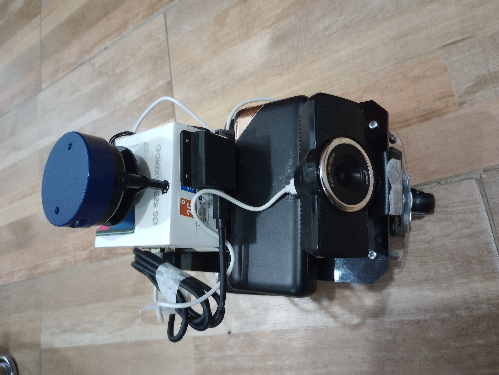

# DIY-SLAM-Robot
Simple teleoperated robot in ROS Noetic built with a raspberry pi4, it's easy to do and you can  
use this code as an example, you may have to change some things for hardware differences.  

## Advertise
This project was done on ROS Noetic Ninjemys, by the way, I removed catkin data and some other  
unnecesary stuff for the scope of this repository so, there are just example scripts to adapt  
to your necesities and build your own packages. 
  
---
  

## Hardware
- Raspberry pi 4
- YDLidar X2
- 2 DC Motors
- Plastic and 3D printed bases for the structure
- Lithium batteries
- 3Amp powerbank
- Usb camera
- DC voltaje regulator
- L298N
- Wires
- Switch

The connections are pretty simple, this is not a tutorial but maybe I can give you some idea.  

First connect the raspberry pi to the L298N, then connect the L298N to the motors, to power  
the L298N I used the 5 volts from the raspberry pi, and the power of three lithium batteries  
through the DC voltaje regulator, the powerbank is used to power the raspberry pi, and the  
camera is connected to the raspberry pi through the usb port, the lidar that you can see in  
the image, is connected through the usb port too.

## Software
- ROS Noetic
- Ubuntu 20.04
- Python 3.8.5

## How to build it
First of all, you need to install ROS Noetic on your raspberry pi, and do your proper hardware   
connections.  

If you want to follow what I did, you can use as example the pinout defined in motor_handler.py.    

For the use of the usb camera, I installed the package usb_cam, you can find it on the ROS wiki,    
and it will work fine with the launch file I made.

For the lidar, it's specific for what you have, I had the YDLidar X2, so I used the package that  
you can find in this [link](https://github.com/YDLIDAR/ydlidar_ros_driver).  

When building your packages, I used the cam_pkg and motor_manager in the raspberry pi, the  
functions_handler and the keyboard_actions were on my pc connected to the same network, so  
I used the ROS_MASTER_URI and ROS_IP to connect them, you can find more information about it 
in the ROS wiki.  

For building the maps, the robot is pretty simple so I used the hector_slam package, for doing   
visual SLAM, depending on your robot you may need to use another package, but this one is pretty  
well for this project, it's easy to use, it works fine, the maps are precise, and the robot do  
not have info about physical odometry or another sensor, the camera is used for seeing in real  
time where the robot is, so I can teleoperate it well.

## How to use it
The use is pretty simple, you just need to run the launch files, functions_handler/robot_full_launch.launch  
and motor_manager/full_launch.launch, the first one is for the pc, and the second one is for the raspberry pi.

Because you are using hector mapping, you need to move the robot around the place you want to map,  
it works well but, here are some tips:  
1. Decrease the speed of the robot with the letter q, it will be more precise.
2. When the robot is turning around, it needs to be as slow as possible, fast changes  
   can make the robot lose the position and it will ruin your map.
3. Set your minimum and maximum laser range accordingly to the space you are mapping,  
   in a small place, a range from 0.1 to 3.0 is good, but in a big place, you may need   
   to increase the maximum range so hector slam can work better.
4. The corners are good places to locate your robot, if it is losing the position,  
   you can move it to a corner and stop for a while. 
5. Obstacles can be seen as something to avoid, but in visual SLAM, they are pretty    
   useful for the robot to know where it is, so, if you are mapping a place with a lot    
   of obstacles, it will be easier for the robot to locate itself.

Here is a map I made with this robot, it was a small place with a lot of obstacles.  
  
Here is another one, it was a big place with few obstacles so I needed to change laser parameters.   
 

## How to improve it
This robot is pretty simple, so you can improve it in a lot of ways, here are some ideas:
1. Add a IMU sensor, it will be useful for the robot to know its orientation, and it will  
   be more precise when turning around.
2. Add encoder sensors, it will be useful for the robot to know how much it has moved,  
   and it will be more precise when moving around.
3. Use a better lidar, the YDLidar X2 is good, but it has a small range, so you can use  
   a better one, it will be more precise when mapping.
4. With artificial vision, you can make the robot detect obstacles and avoid them, or other  
   uses like detecting objects and taking them to another place.

## How to contact me
If you have any question, you can contact me at my linkedIn profile, send me a message or send me a   connection, I will be happy to help you.  
LinkedIn: [Juan Andres Ramirez Pachon](https://www.linkedin.com/in/jramirez-jarp/)
